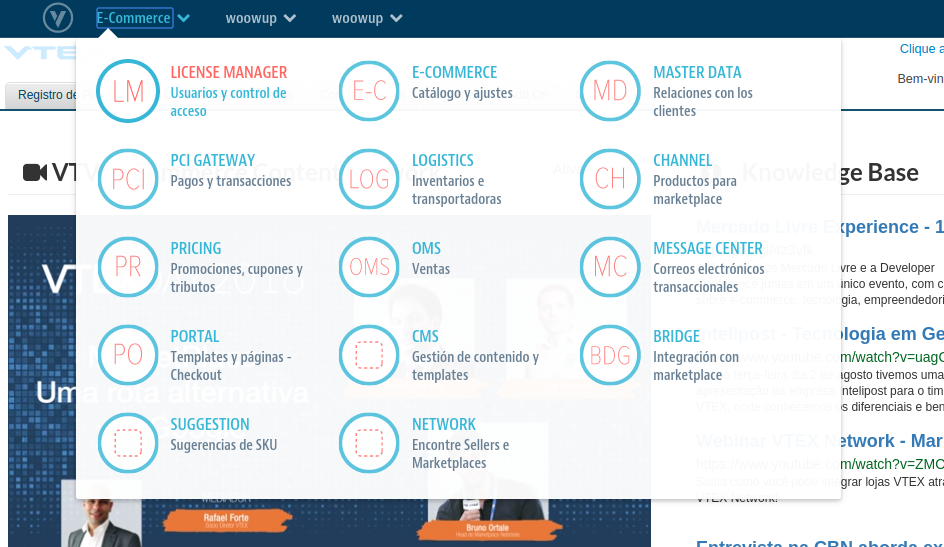
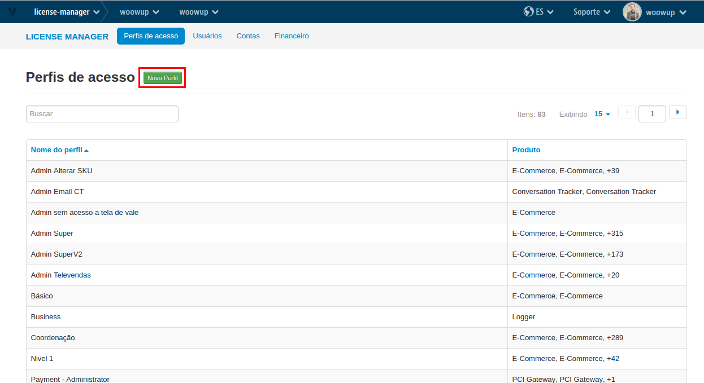
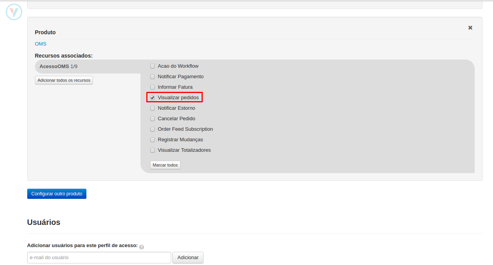
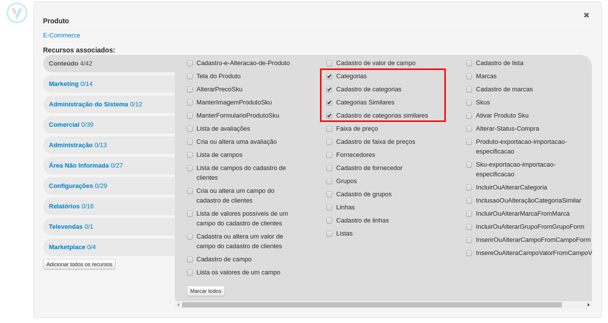
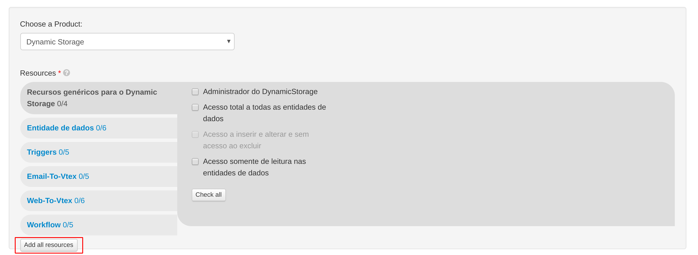
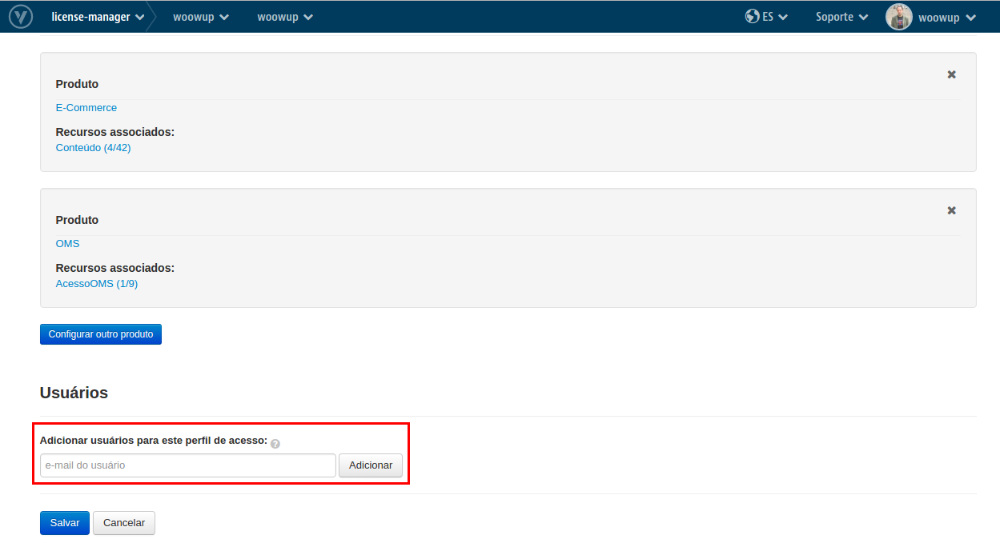

# Creando un perfil de acceso VTEX

En este tutorial se explicará cómo crear un perfil de acceso para poder integrar su tienda VTEX con WoowUp. Básicamente lo que vamos a intentar hacer es crear un nuevo perfil de acceso en tu panel de VTEX con los permisos necesarios como para tomar la información del catálogo.

### Creación del perfil

Primero debemos entrar a License Manager de mi tienda

Luego hacer click en "Nuevo Perfil"

Se nos abrirá el formulario para crear el nuevo perfil de acceso. Primero ingresamos un nombre para este perfil que puede ser "Acceso WoowUp" o el nombre que desee. Luego debemos asinarle los permisos necesarios para poder acceder a la información.

Primero le daremos acceso dentro de **OMS** a **Visualizar pedidos**, con esto ya podemos descargar las ventas realizadas.

Luego necesitamos acceso para poder descargar el arbol de categorías de la tienda. Para esto daremos acceso a la administración de categorías dentro de **E-Commerce** como se muestra en la imagen.

También para poder configurar los Triggers de carrito abandonado necesitamos acceso a **Dynamic Storage**, para esto agregaremos un nuevo permiso y clickearemos en el botón de __Agregar todos los recursos__

Por último lo que tenemos que hacer es agregar un usuario a este nuevo perfil, el correo eletrónico del usuario se lo proporcionará WoowUp.

Una vez agregado el usuario guardaremos el perfil de acceso creado y listo! ya tenemos nuestro perfil de acceso configurado.
