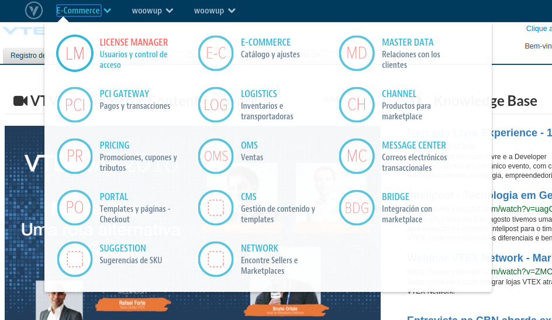
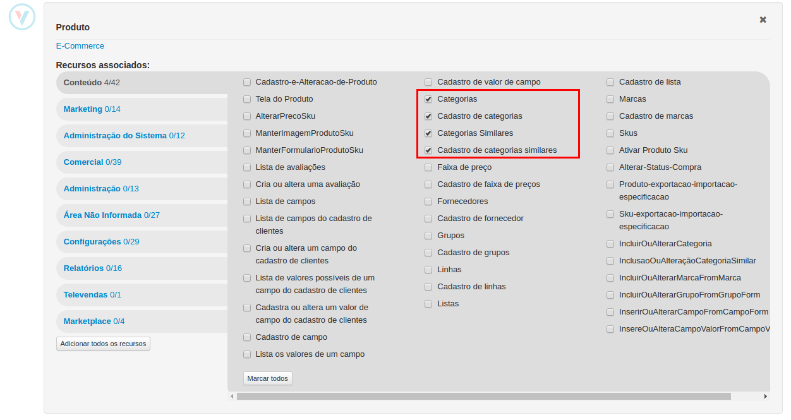

# Criar um perfil de acesso VTEX

Em este tutorial vamos explicar cómo criar o perfil de acesso para integrar sua loja VTEX com a WoowUp. Para isso temos que criar um novo perfil de acesso em seu panel de VTEX com as permissões para pegar a informação do catálogo.

### Criaçaão do perfil

Ingresse ao License Manager de sua loja

Clickar em "Novo Perfil"

Vai se abrir o formulario para criar o novo perfil de acesso. Primero preencher o nome para este perfil que pode ser "Acesso WoowUp". Depois temos que atribuir as permissões necessárias para ter acesso à informaçāo.

Vamos dar acesso dentro do **OMS** para **Visualizar pedidos**, para que possamos baixar as vendas realizadas.

Em seguida necesitamos acesso para poder baixar o árvora de categorías da loja. Vamos dar acesso á administraçāo de categorías em **E-Commerce** como pode-se ver nesta imagen.

Finalmente temos que adicionar um usuario para este novo perfil, o email do usuario vai ser indicado pela WoowUp.

Agora so temos que salvar o perfil de acesso criado e pronto! Ja temos nosso perfil de acesso configurado.
