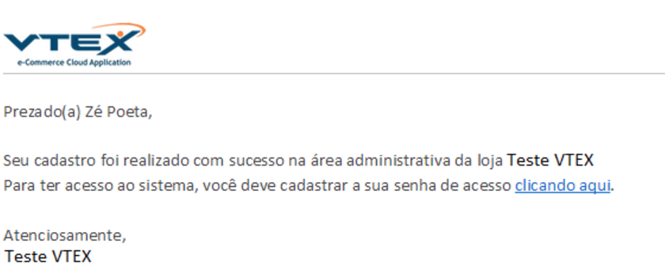
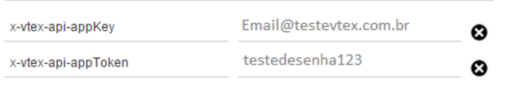

# How to create a VTEX user

This tutorial try to explain how to create the user that will be used to sinchronize your vtex commerce with our platform. Basicaly we create a new user in your vtex administrator with the apropiated credentials to access to your catalog information.

### How to create a REST user

First we need to create an user:

1. Go to "License Manager"

2. Go to "Usuarios" --> "Novo Usuario"

3. An email will be sent to your email to validate your user. Enter your email and the number from the email.

4. This validation will require a new password for user access.

5. Later, the system request to you to autenticate in vtex with the recived data.

6. Create an user and give access to the module *Admin Super*

This redirect to you directly to the ecommerce confirming that the user would be created ok.

7. Copy the *USUARIO* and *CONTRASEÑA* that will work later as *AppKey* and *AppToken* respectively.

### How to know my store ID?

To know my store ID is necesary follow the next steps. This ID is used to identify what store must send the information to the API.

With this information (user, password and store ID) we are ready to sinchronize your store with WoowUp, send us this data.
