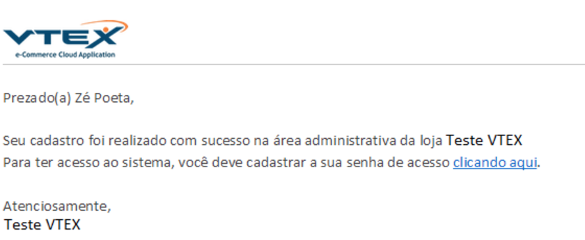
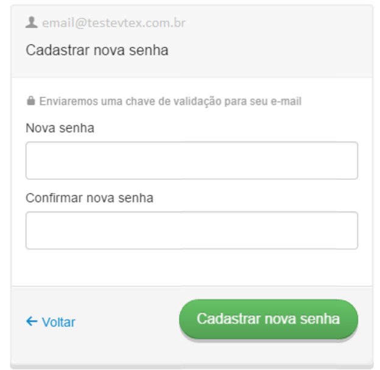
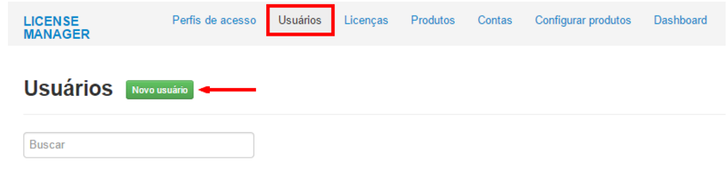
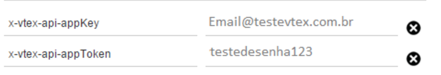
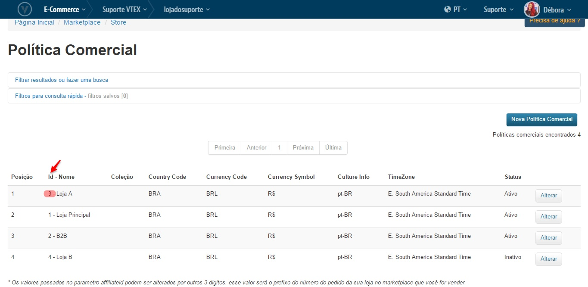

# Creando un usuario VTEX

En este tutorial se explicará cómo crear el usuario que se va a utilizar para que WoowUp pueda sincronizarse con tu tienda VTEX. Básicamente lo que vamos a intentar hacer es crear un nuevo usuario en tu panel de VTEX con los permisos necesarios como para tomar la información del catálogo.

### Cómo Crear las Credenciales REST

Ahora vamos a generar las credenciales del acceso REST.

Deberemos primero crear un usuario.

1. Entrar a License Manager de mi tienda

2. Ir a Usuarios --> Novo Usuario

3. Se le enviará un mail para validar la creación del usuario. Ingrese a su correo e ingrese el número que se le envió.

4. Esta validación exigirá una nueva contraseña para el acceso del usuario.

5. Luego se le pedirá autenticarse nuevamente en VTEX con los datos recibidos.

6. Crear un usuario y dar acceso al módulo *Admin Super*

Esto lo llevará directo a la tienda confirmando que el usuario fue creado satisfactoriamente.

7. Copie ahora el *USUARIO* y *CONTRASEÑA* que funcionarán posteriormente como *AppKey* y *AppToken* respectivamente.

### Conociendo el ID de mi Tienda

Para conocer el ID de la tienda es necesario seguir los siguientes pasos. Este ID sirve para identificar qué tienda debe enviar la información correspondiente a la API.

Con estos datos (usuario, contraseña y ID de la tienda) ya estamos listos para sincronizar tu tienda con WoowUp, envianos estos datos a nosotros y listo!
