Woowup Magento Connect
====================

Setup
----------------
Follow these steps:

1) [Download this zip file](https://github.com/woowup/docs/raw/master/magento_connect/Woowup_Connect-0.3.0.tgz)  
2) Install the connector through Magento Connect  

3) Configuring the SOAP user  
Go back to Magento's admin and select System->Web Services->Soap/XML-RPC Roles 
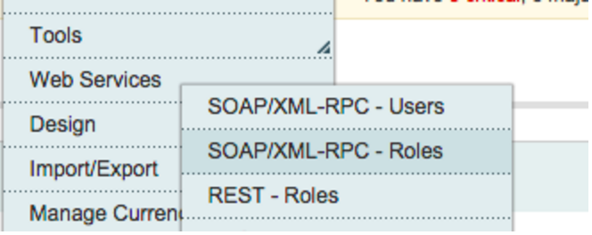</img>

4) Click on Add new Role  

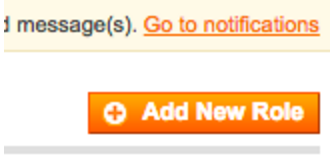</img>

5) Go to Role Info tab and create a new role with name "Coupon generator". Click Save Role.  

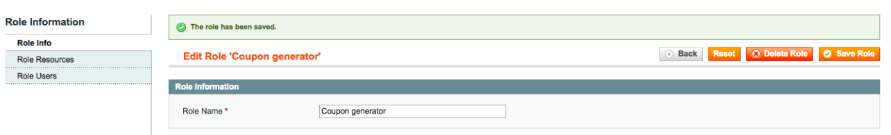</img>

6) Go now to Role Resources tab.  
 
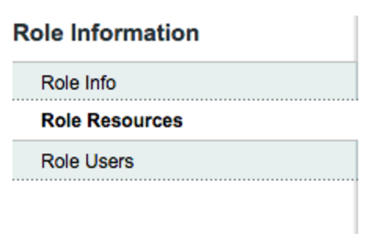</img>

7) Go down until you find WoowUp API. Select it and click again in Save Role (up in the right).  
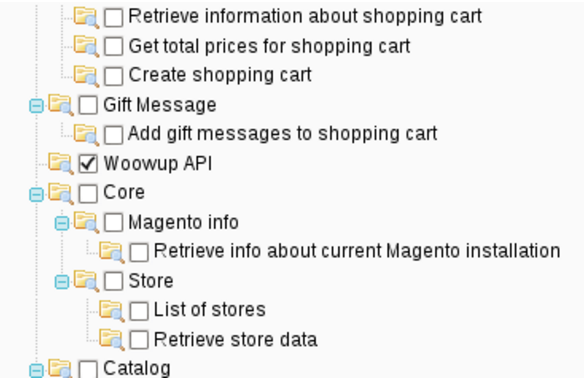</img>

8) From the System menu, select Web Services->SOAP/XML-RPC Users. 
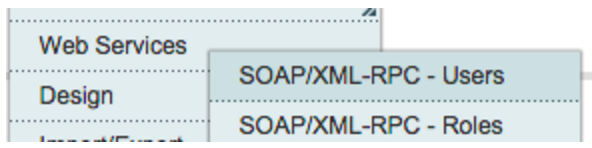</img>

9) Click in Add New User to create a new user. 
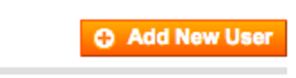</img>

10) Create a new user with name Woowupuser.
Choose a password and type it in the New API Key field and again in the API Key Confirmation field. Then click Save User.  
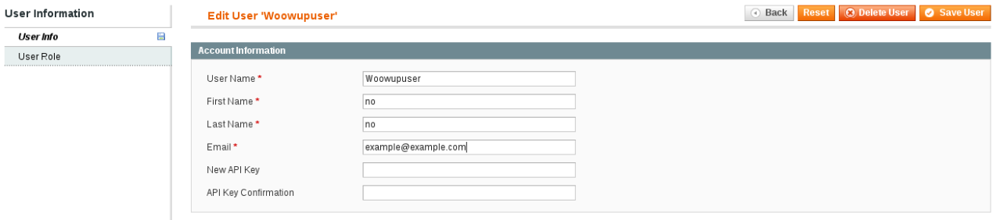</img>

11) Now click in User Role. Assign the Coupon generator role and click on Save user. 
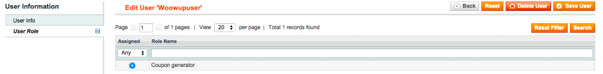</img>

12) Go to Magento's backend, then to  System -> Configuration -> WOOWUP -> Configuration.  

- To get access to WoowUp API from your app, you need the API Key and Contest ID. You will find it in the administrator console, inside the Connect tab. Or you can write us to <mailto:api@woowup.com> for help.

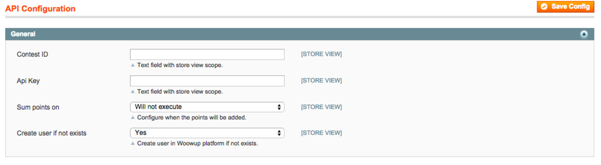</img>

You can choose in which purchase order event the customer will receive its points:

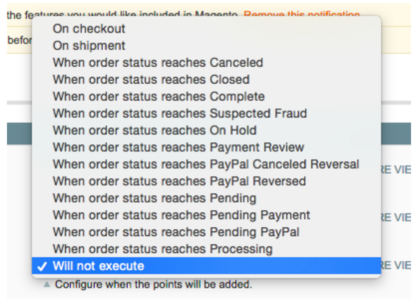</img>

Create user if not exists: Chooes yes to auto-register new customers with its first purchase. If you choose NO, you are forcing customer to first enroll in your Loyalty Program before they can earn points.
 
Save all the changes.  
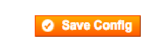</img>

Finally, take note of:
1. Your magento store URL.
2. Soap user and password

You will need to complete this information in WoowUp backoffice (Connect Tab):

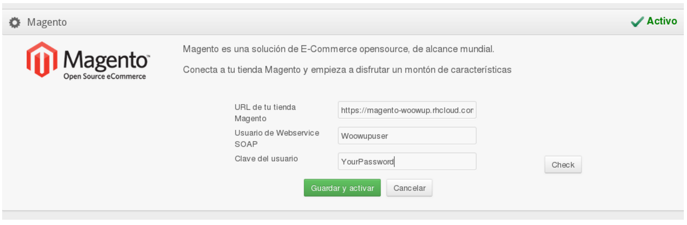</img>

Configuring the widget
------------------------
- Optionally you may want to configure the "Earn points" widget. To do this, go to the menu "CMS/Widgets" and create a new widget of the type "Woowup Points".

The plugin brings twe sample templates to show the points next to the product price (Product Extra Hints) or in the column blocks (Right block). 

Using the widget option you can change the template to use your own. 

Once the widget is active, next to the product you'll see how many points you may earn.

Or use it in the columns of your site.

Development
----------------
You can find the connector source code here: 
[Repositorio](https://bitbucket.org/woowup/woowup-magento-connect/overview).
